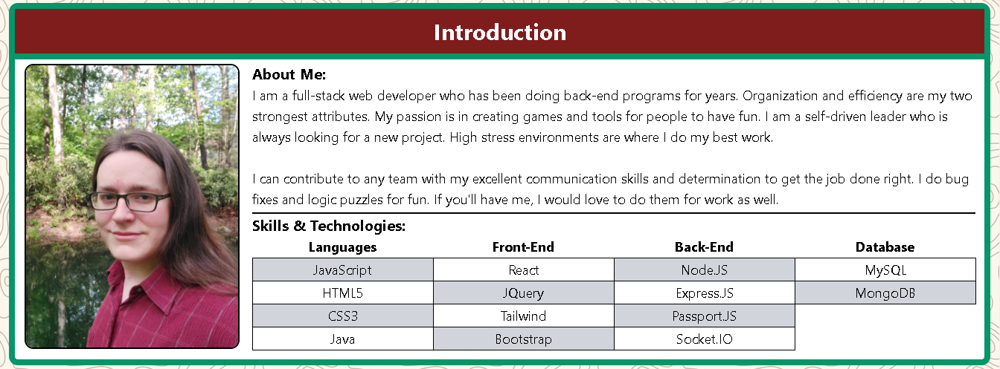
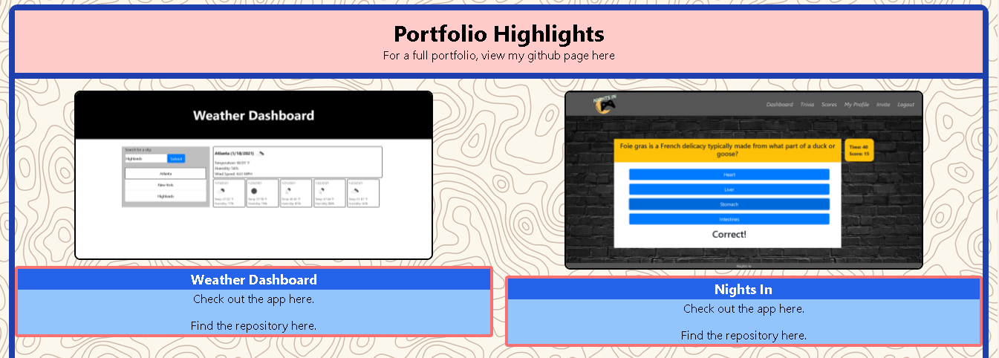

# John Paul Grace

## Link to Website
https://john-paul-grace.github.io/

## Description

This is a portfolio website to act as my online resume. It features:
- a header with a logo I made for myself
- an introduction with some information about me
- a table of my tech skills
- four projects that I would like to highlight from my portfolio
- and a sticky footer with contact and navigation info

This website was made using React and Tailwind. It has been designed to be responsive for different device sizes.

## Screenshots

