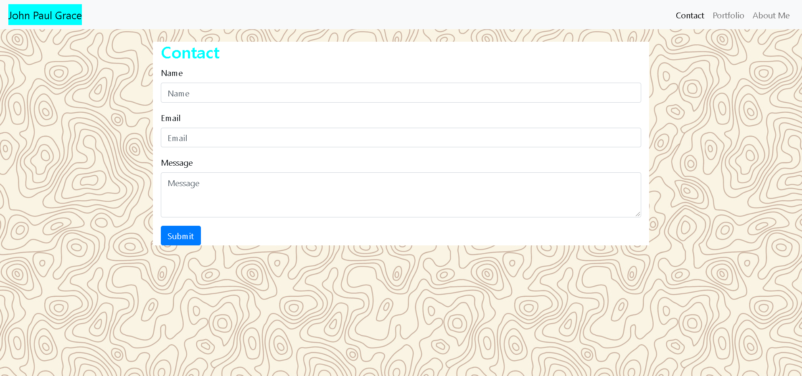
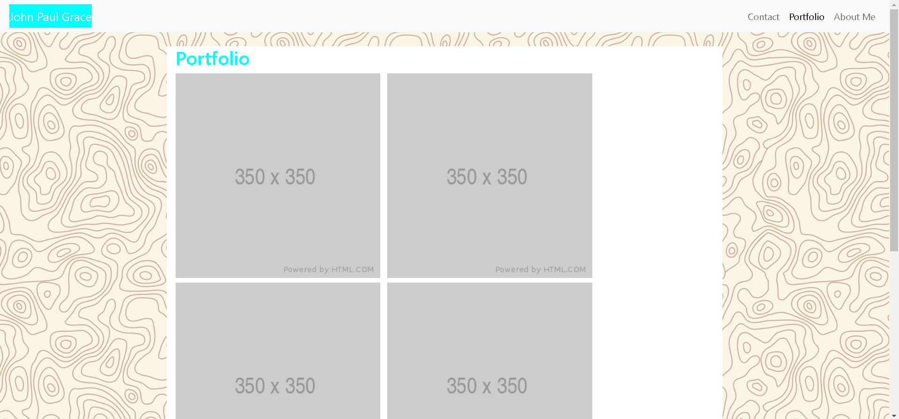

# John Paul Grace

## Link to Website
https://john-paul-grace.github.io/

## Description

This is a portfolio website designed to be responsive for different device sizes. The navigation bar can be used to access three pages with information about me. The first is the "About Me" page which is the index file. There is also a page for "Contact" and another for "Portfolio". This website serves as my online resume. 

## Contributions

This website was built from the ground up by me with the help of the Bootstrap framework version 4.5. I used the "Navbar" and "Forms" components, as well as the grid system included with Bootstrap.

## Screenshots

